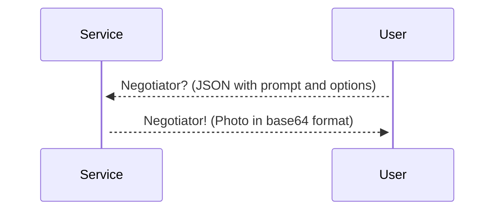
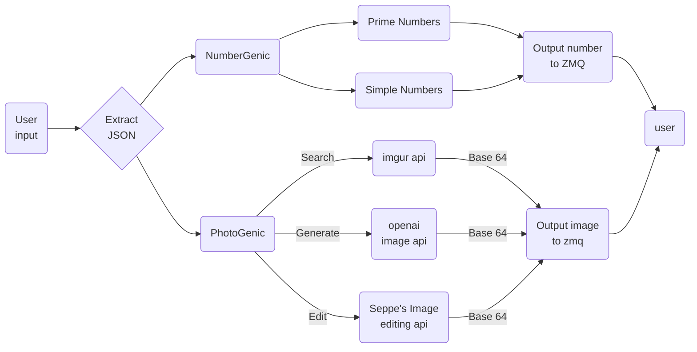

# Benternet-ZMQ# Benternet-ZMQ


This is how the basics work 



this works with the following flowchart



The Json has this structure

```json
{
    "RequestType": "Image",
    "ImageType": "Generate",
    "Prompt": "A penguin in a suit",
    "Resolution": "512x512",
    "Spellcheck": "True"
}
```

or you could ask for a prime number, simple number or other by changing the json

```json
{
    "RequestType": "Number",
    "NumberType": "Prime",
    "CheckNumber": "false",// if checknumber is true, it checks if prompt is of number type
    "Prompt": "5", // in this case it gives the fifth prime number
}
```

failsafes,

als niet geldig altijd een respons sturen

