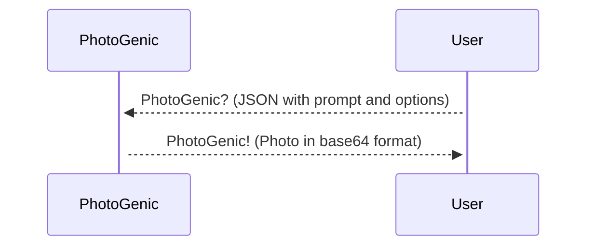
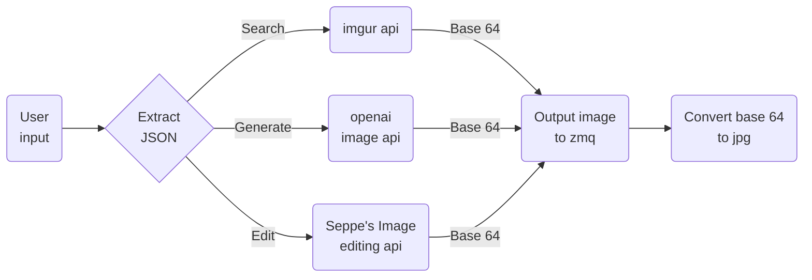

# Benternet-ZMQ

```mermaid
sequenceDiagram
    participant PhotoGenic
    participant User

    activate User
    activate PhotoGenic
    User-->>+PhotoGenic: PhotoGenic? (JSON with prompt and options)
    PhotoGenic-->>+User: PhotoGenic! (Photo in base64 format)
```

this works with the following flowchart

```mermaid
flowchart LR
    INPUT(User</br> input)
    JSON{Extract </br>JSON}
    OUTPUT(Output image </br>to zmq)
    USER_OUTPUT(Convert base 64</br>to jpg)
    INPUT-->JSON
    IMGUR(imgur api)
    OPENAI(openai</br>image api)
    SEPPE(Seppe's Image </br>editing api)
    JSON--Search-->IMGUR
    JSON--Generate-->OPENAI
    JSON--Edit-->SEPPE
    IMGUR & OPENAI & SEPPE --Base 64 -->OUTPUT
    OUTPUT-->USER_OUTPUT
```

